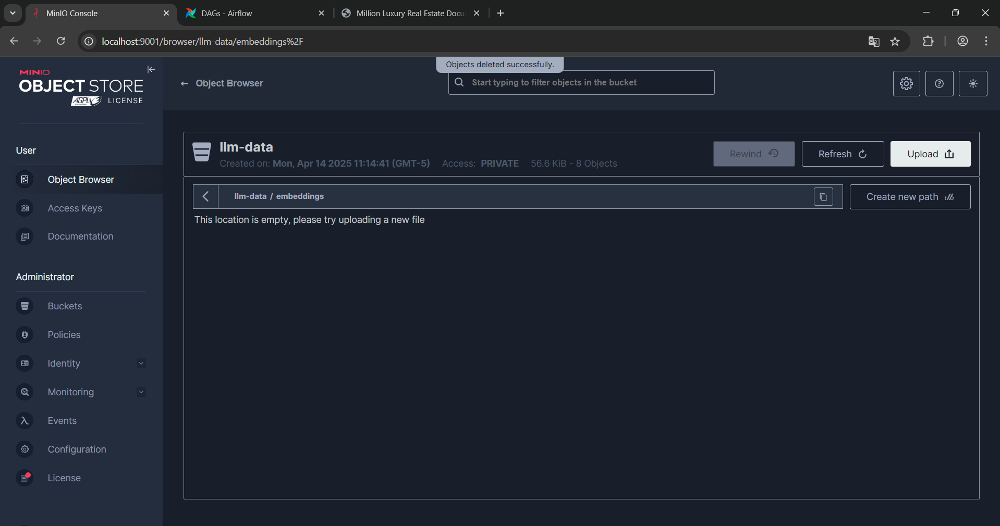
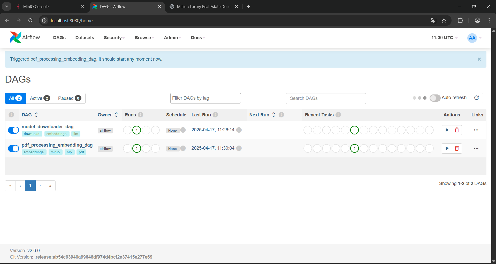
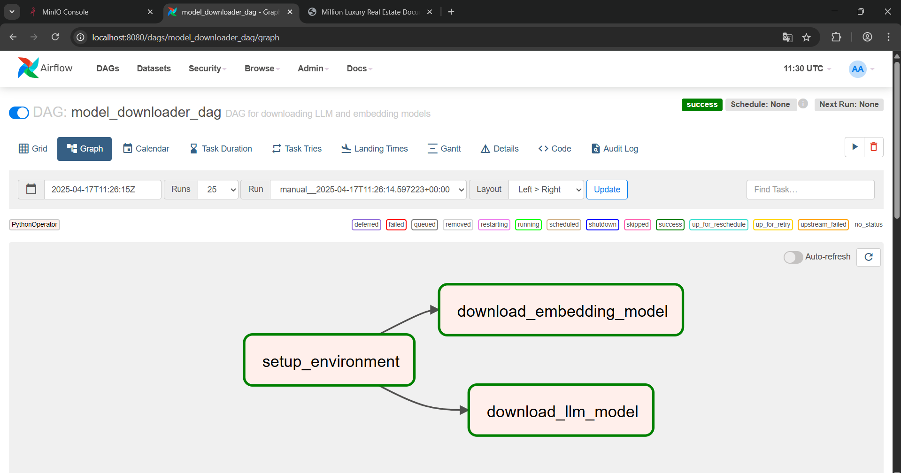
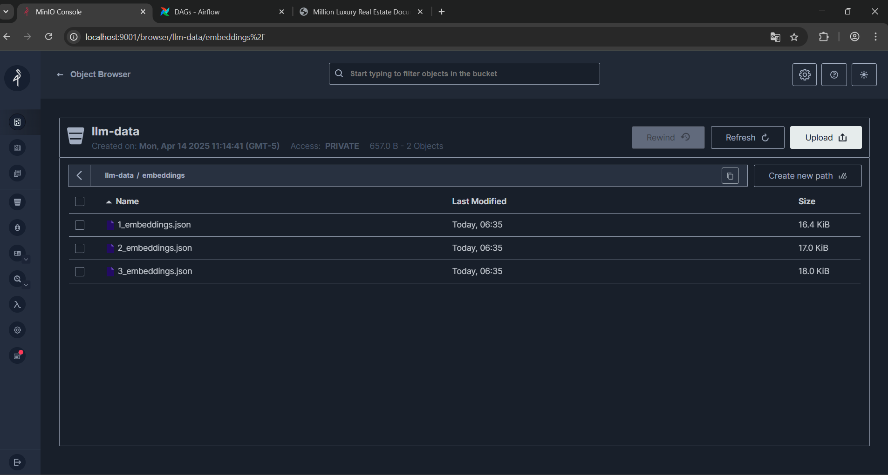
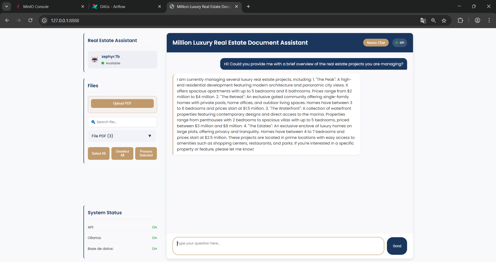

# Million Luxury Real Estate Document Assistant

## Project Overview

A comprehensive data processing and machine learning platform for luxury real estate document analysis, integrating advanced technologies to streamline document processing, semantic search, and intelligent querying.

## System Architecture

### Core Components
1. **Apache Airflow**: Workflow Orchestration
   - Document processing pipelines
   - Text extraction and preprocessing
   - Embedding generation
   - Metadata management

2. **Ollama**: Local Language Model (LLM) Management
   - Text embedding generation
   - Intelligent question-answering
   - Model download and versioning

3. **FastAPI**: Web Interface and API
   - Document upload and management
   - Real-time querying
   - Interactive documentation

4. **Databases**
   - **PostgreSQL**: Airflow metadata and workflow management
   - **MySQL**: Application-specific data storage
   - **MinIO**: Object storage for embeddings and documents

## Project Structure

```
million-luxury-assistant/
.
├── airflow
│   ├── Dockerfile
│   └── dags
│       ├── Download_model.py
│       └── Text_processor.py
├── api
│   ├── Dockerfile
│   ├── Front
│   │   └── templates
│   │       └── index.html
│   ├── main.py
│   └── requirements.txt
├── data
│   ├── BAYFRONT RESIDENCES.pdf
│   ├── BRICKELL HOME LUXURY.pdf
│   └── UNA CLUB.pdf
├── docker-compose.yml
├── minio-data
│   └── llm-data
│       ├── embeddings
│       ├── metadata
│       └── processed
├── models
├── screenshots
│   ├── START.png
│   └── STOP.png
├── start-million-luxury.sh
└── README.md
```

## MinIO Bucket Configuration

### Important Note
- The MinIO bucket named `llm-data` must be created manually before starting the application.
- Steps to create the bucket:
  1. Access MinIO Console (typically at `http://localhost:9000`)
  2. Log in with default credentials (minioadmin/minioadmin)
  3. Create a new bucket named exactly `llm-data`
  4. Ensure the bucket has the following subdirectories:
     - `embeddings/`
     - `metadata/`
     - `processed/`



## Document Processing Workflow with Airflow

### Key Processing Steps
1. **Text Extraction**
   - PDF parsing using PyPDF2
   - Multiple extraction techniques

2. **Text Preprocessing**
   - Contraction expansion
   - Whitespace normalization
   - Lemmatization
   - Stopword removal

3. **Semantic Embedding**
   - Utilizing Ollama's `nomic-embed-text` model
   - Generating document chunk embeddings

4. **Metadata Management**
   - Tracking document processing status
   - Storing document information in MySQL

5. **Download LLM**
   - Model for generating embeddings  (nomic-embed-text)
   - Base model for the chat (llama3:8b)





## LLM Chat Interface

### Interactive Document Assistant

The chat interface provides an advanced conversational experience for interacting with uploaded real estate documents:

1. **Document Context Preparation**
   - Automatically indexes uploaded documents
   - Generates semantic embeddings for document chunks
   - Creates a comprehensive document knowledge base

2. **Chat Interaction**
   - Natural language conversations about document contents
   - Supports multi-turn dialogues
   - Context-aware response generation

3. **Key Capabilities**
   - Detailed document exploration
   - Semantic search across document collections
   - Precise information extraction
   - Contextual understanding of luxury real estate documents

4. **Technical Processing**
   - Query transforms to semantic embedding
   - Retrieval of most relevant document chunks
   - Large Language Model (LLM) generates precise, contextual answers
   - Maintains conversation history and context

5. **Access**
   - Web interface at `http://localhost:8888/chat`
   - Supports multiple document types (primarily PDFs)
   - Real-time interaction with document knowledge base



## Technologies and Dependencies

### Core Technologies
- Python 3.9
- Apache Airflow 2.6.0
- Ollama
- FastAPI
- Docker
- MinIO
- Redis
- PostgreSQL
- MySQL

### Key Python Libraries
- Web Framework: FastAPI, Uvicorn
- Data Processing: Pandas, NumPy, NLTK
- Machine Learning: PyTorch
- Utility: Requests, Jinja2

## PyTorch Integration

### Device Management
- Automatic GPU/CPU detection
- Hardware-aware model initialization
- Efficient computational resource utilization

```python
TORCH_DEVICE = "cuda" if torch.cuda.is_available() else "cpu"
```

## Ollama Language Models

### Primary Models
- **Document Analysis**: Mistral
- **Embedding Generation**: Nomic Embed Text

### Model Features
- Automatic download and version tracking
- Dynamic context-aware responses
- Multilingual support
- Semantic chunk retrieval

## Service Ports

| Port | Service | Description |
|------|---------|-------------|
| 8080 | Airflow | Workflow Management UI |
| 8888 | API | FastAPI Backend with Swagger UI |
| 11434 | Ollama | Local Language Model Service |
| 9000 | MinIO | Object Storage |
| 5555 | Airflow Flower | Celery Monitoring |
| 6379 | Redis | Message Broker |
| 3306 | MySQL | Application Database |
| 5432 | PostgreSQL | Airflow Metadata |

## Deployment

### Prerequisites
- Docker
- Docker Compose
- System Requirements:
  - 8GB+ RAM
  - 2+ CPU cores
  - 20GB+ free disk space
  - Optional: NVIDIA GPU

### Installation Steps
1. Create MinIO `llm-data` bucket manually
2. Clone repository
3. Make startup script executable
4. Run: `./start.sh`
5. Access services via respective ports

## Future Improvements
- Enhanced semantic document chunking
- User authentication
- Answer quality feedback mechanism
- Expanded document format support
- Kubernetes deployment for scalability

## Troubleshooting
- Check Docker logs: `docker-compose logs <service-name>`
- Verify PDF processing permissions
- Confirm database connectivity
- Ensure MinIO `llm-data` bucket is created
- Use `CUDA_VISIBLE_DEVICES=0` for GPU support

## Default Credentials
- **Airflow**: airflow/airflow
- **MinIO**: minioadmin/minioadmin

## Developer Note

Despite the limited time available due to my current schedule, I have thoroughly enjoyed working on this technical challenge. I will continue to make ongoing improvements as part of my learning process, as I found it to be a highly engaging and rewarding experience. As such, this repository will continue to be updated regularly.

The only remaining tasks at this point include:
- Implementing a cache mechanism to store chat history.
- Expanding support for multiple tools within the chat.
- Enhancing the embedding process during PDF loading.

Although these additions were not part of the initial problem statement, they follow good development practices and are intended to further improve the user experience.
