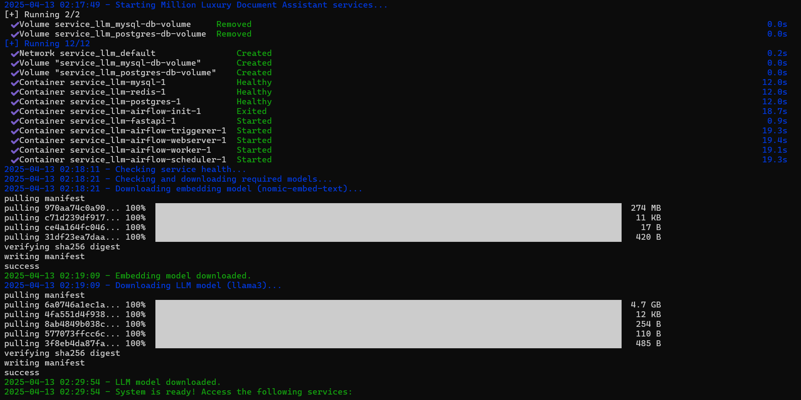
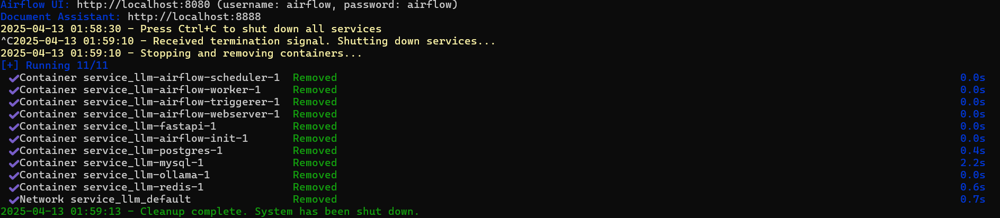

# Million Luxury Real Estate Document Assistant

A comprehensive solution for processing real estate documentation, enabling users to query documents and receive precise answers using natural language processing.

## System Architecture

This project implements a document processing and question-answering system with the following components:

1. **Apache Airflow**: Handles document processing workflows:
   - Text extraction from PDFs
   - Text cleaning and preprocessing
   - Embedding generation
   - Metadata storage

2. **Ollama**: Local LLM server for:
   - Text embeddings generation
   - Question answering

3. **FastAPI**: Provides a web interface and API for:
   - Document uploading
   - Document querying
   - Real-time chat

4. **MySQL**: Database for storing:
   - Document metadata
   - Processing status

## Project Structure

```
project/
├── .env                    # Environment variables
├── docker-compose.yml      # Docker Compose configuration
├── dags/                   # Airflow DAG definitions
│   └── document_processing.py  # Document processing pipeline
├── api/                    # FastAPI application
│   └── app/
│       └── main-app.py     # API and chat interface
├── data/                   # Document storage
├── models/                 # Embeddings and model storage
└── logs/                   # Log files
```

## Setup Instructions

### Prerequisites

- Docker and Docker Compose
- At least 8GB RAM
- 20GB+ free disk space
- NVIDIA GPU (optional, for faster LLM inference)

### Installation

1. Clone this repository:
   ```bash
   git clone <repository-url>
   cd million-luxury-assistant
   ```

2. Copy the provided files to the appropriate directories:
   - Copy `document_processing.py` to `dags/`
   - Copy `main-app.py` to `api/app/`
   - Copy `.env` to the project root
   - Copy `start-million-luxury.sh` to the project root

3. Make the startup script executable:
   ```bash
   chmod +x start-million-luxury.sh
   ```

4. Start the services using the provided script:
   ```bash
   ./start-million-luxury.sh
   ```
   
   
   
   This script will:
   - Create necessary directories
   - Start all Docker services
   - Download required Ollama models
   - Keep running until you press Ctrl+C
   - Gracefully shut down all services when terminated
   
   

5. To stop all services, simply press Ctrl+C in the terminal where the startup script is running.

6. Access the different components:
   - Airflow UI: http://localhost:8080 (username: airflow, password: airflow)
   - Document Assistant: http://localhost:8888

### Processing Documents

1. Upload PDF documents through the web interface at http://localhost:8888
2. Documents will be automatically processed by the Airflow DAG
3. Processing steps:
   - Text extraction
   - Text cleaning and lemmatization
   - Embedding generation
   - Metadata storage in MySQL

### Querying Documents

1. Access the chat interface at http://localhost:8888
2. Select the documents you want to query (or leave all unchecked to query all)
3. Enter your question in natural language
4. The system will:
   - Convert your query to an embedding
   - Find the most relevant document chunks
   - Use the LLM to generate a precise answer

## Components Details

### Document Processing Pipeline

The document processing pipeline handles:

1. **Text Extraction**: Extracts raw text from PDF documents using PyPDF2
2. **Text Cleaning**:
   - Expands contractions
   - Normalizes whitespace and numbers
   - Lemmatizes words
   - Removes stopwords
3. **Embedding Generation**: Creates embeddings using Ollama's API
4. **Metadata Storage**: Stores document info in MySQL for easy retrieval

### FastAPI Application

The FastAPI application provides:

1. **Web Interface**: HTML/JS interface for interacting with the system
2. **REST API**: Endpoints for document and query management
3. **WebSocket**: Real-time chat interface
4. **Document Upload**: Functionality to add new documents

### Ollama Integration

Ollama provides:

1. **Embedding Generation**: The `nomic-embed-text` model for generating embeddings
2. **LLM Inference**: Models like Llama3 or Mistral for generating answers

## Troubleshooting

- **Docker Issues**: Check container logs with `docker-compose logs <service-name>`
- **PDF Processing Errors**: Verify PDF permissions and encoding
- **Database Connectivity**: Ensure MySQL credentials are correct in `.env`
- **GPU Support**: Add `CUDA_VISIBLE_DEVICES=0` to `.env` if using GPU

## Further Improvements

- Implement document chunking strategies based on semantic sections
- Add user authentication and document access controls
- Integrate feedback mechanism to improve answer quality
- Add support for additional document formats (DOCX, TXT)
- Deploy the system with Kubernetes for better scalability